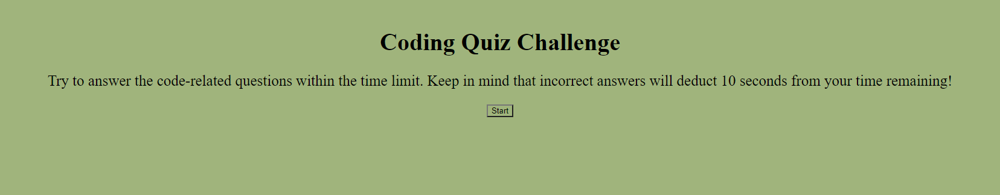

# code-quiz

Code Quiz tests your knowledge on 5 different coding-related questions, with a time limit of 90 seconds. Score is calculated at the end for the amount of seconds remaining, and user is able to save their high score by their initials. 

Link: https://rachelgray7448.github.io/code-quiz/

